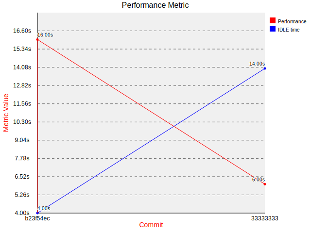
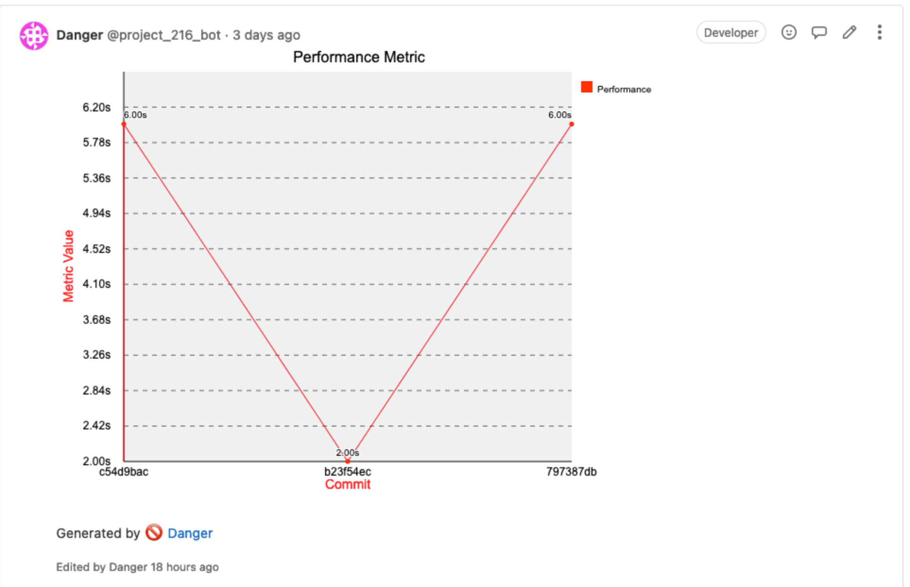

# danger-gitlab_graph

`danger-gitlab_graph` is a [Danger](https://danger.systems) ruby plugin that allows you to extract and display metrics
gathered from the current and previous pipeline runs. This plugin is only works with GitLab CI at the moment.

It works similar to the existing test coverage extraction provided by GitLab natively: You provide a job name, an
extraction regex (including a single capturing group) and some other, optional configuration options. The plugin then
creates an svg graph (using the [svg-graph2](https://github.com/lumean/svg-graph2) gem) and adds them to your other
Danger comments.

## Installation

    $ gem install danger-gitlab_graph

## Usage

    Methods and attributes from this plugin are available in
    your `Dangerfile` under the `gitlab_graph` namespace.

### Methods

`gather_metric` - Gathers metric data from current and pevious pipelines

Sample code:

```ruby
@my_plugin.gather_metric({
                           regex: /took ([0-9]+)/,
                           series_name: "Performance",
                           job_name: "test1"
                         })
```

returns an array similiar to this:

```ruby
[{ hash: "b23f54ecdc3add9abea9344f66b49f1699bff547", metric: 16.0, pipeline_id: 1119 },
 { hash: "3333333333333333333333333333333333333333", metric: 6.0, pipeline_id: 123_456 }]
```

`report_metric` - Creates and comments a graph based on a certain metric, extracted via regex

Sample code

```ruby
gitlab_graph.report_metric([{
                              regex: /took ([0-9]+)/,
                              series_name: "Performance",
                              job_name: "test1"
                            }, {
                              regex: /slept ([0-9]+)/,
                              series_name: "IDLE time",
                              job_name: "test1"
                            }]) < /pre>
```

outputs a graph similiar to this



and writes it directly into the danger comment:



## Development

1. Clone this repo
2. Run `bundle install` to setup dependencies.
3. Run `bundle exec rake spec` to run the tests.
4. Use `bundle exec guard` to automatically have tests run as you make changes.
5. Make your changes.
